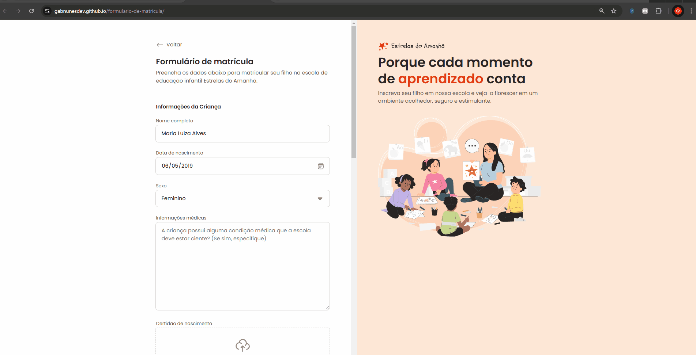

# Formulário de Matrícula

Um formulário de matrícula interativo e responsivo, desenvolvido para fins educacionais, utilizando HTML e CSS.

## Demonstração

> Caso o GIF não carregue, você pode acessar o projeto ao vivo através do link abaixo.

## Acesse o projeto
[Visualizar no GitHub Pages](https://gabnunesdev.github.io/formulario-de-matricula/)

## Tecnologias
- 
- 

## Funcionalidades
- Design simples e intuitivo.
- Formulário validado com padrões HTML5.

